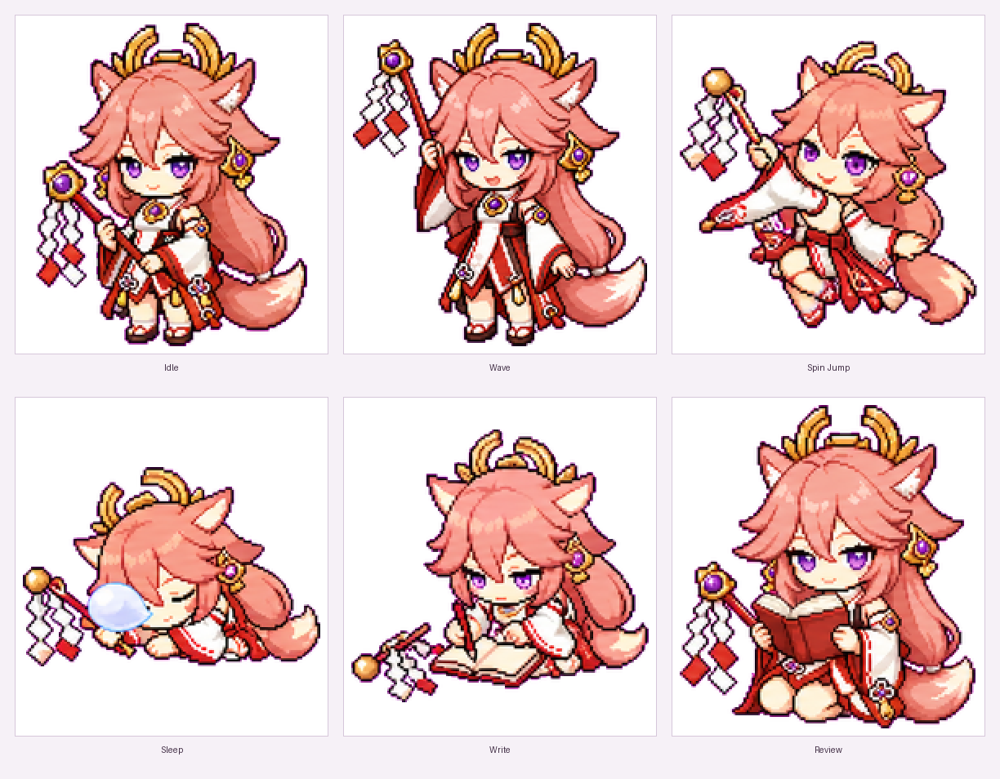
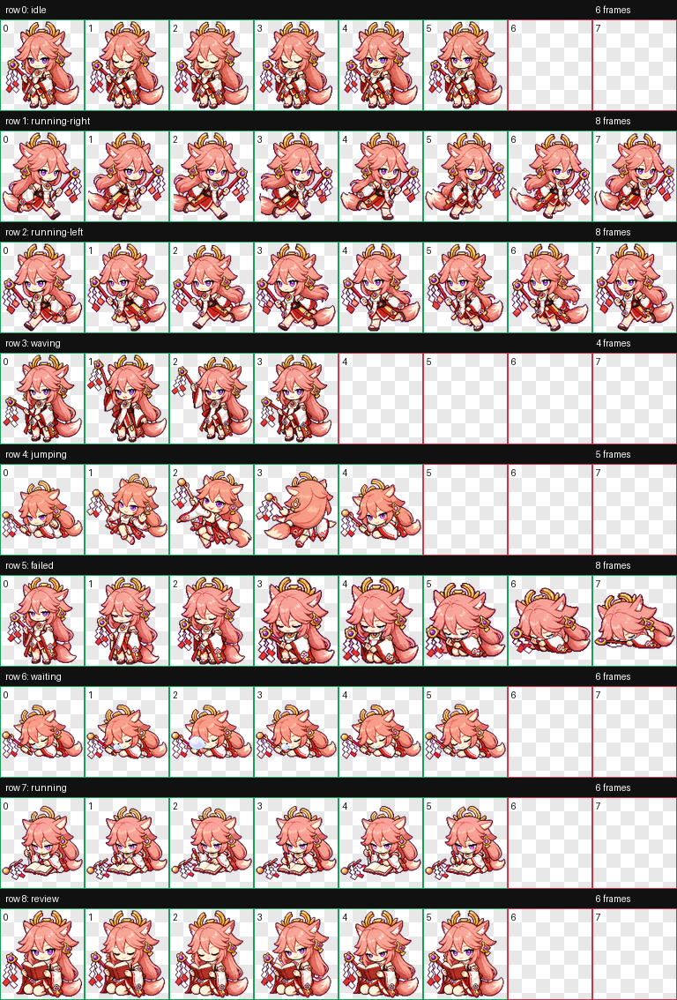

# Miko Pet

Miko is a small Codex desktop pet: a chibi shrine-fox companion inspired by Yae Miko, carrying a red ritual gohei/banner wand.

Miko 是一个 Codex 桌面宠物：以八重神子为灵感的迷你狐狸巫女风格伙伴，手持红色御币/幡杖。

## Preview



## Animation Preview


## Full Contact Sheet



## What Is Included

- `pet/miko/pet.json` - Codex pet manifest.
- `pet/miko/spritesheet.webp` - final 8x9 Codex-compatible animated spritesheet.
- `assets/miko-showcase.png` - showcase image for the pet.
- `assets/miko-preview.gif` - animated GIF preview.
- `assets/contact-sheet.png` - visual QA sheet for all animation rows.
- `qa/validation.json` - atlas validation result.
- `qa/review.json` - frame/component review result.
- `prompts/` - generation and repair prompts used to create the pet.
- `install.sh` - local installer for Codex desktop.

## Install

安装方式：

Clone this repository, then run:

```bash
./install.sh
```

The script installs the pet into:

```text
~/.codex/pets/miko/
```

Restart Codex desktop if the pet list does not refresh immediately.

如果 Codex 桌面端没有立刻刷新宠物列表，重启 Codex desktop。

## Manual Install

You can also copy the files manually:

```bash
mkdir -p ~/.codex/pets/miko
cp pet/miko/pet.json ~/.codex/pets/miko/pet.json
cp pet/miko/spritesheet.webp ~/.codex/pets/miko/spritesheet.webp
```

## Animation Rows

The spritesheet contains these rows:

- `idle`: calm blink loop
- `running-right`: per-frame mirror of `running-left`, preserving frame order
- `running-left`: left-running loop
- `waving`: wand wave
- `jumping`: gohei-in-hand spin dance jump
- `failed`: failed/sad loop
- `waiting`: lying-down sleep with changing nasal bubble
- `running`: writing on a novel, gohei on the ground
- `review`: sitting and reading a novel

## Validation

Latest local validation:

- `qa/validation.json`: `ok=true`, no errors, no warnings
- `qa/review.json`: `ok=true`, no errors, no warnings
- spritesheet: `1536x1872`, `WEBP`, `RGBA`

Preview videos are not included because the local build environment did not have `ffmpeg` available when this pet was packaged.

## Notice

This is an unofficial fan-made generated pet. It is not affiliated with or endorsed by HoYoverse, Cognition, OpenAI, or GitHub. See `ASSET_NOTICE.md` for asset-use notes.
